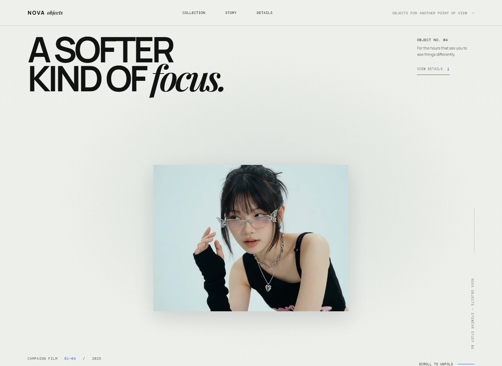
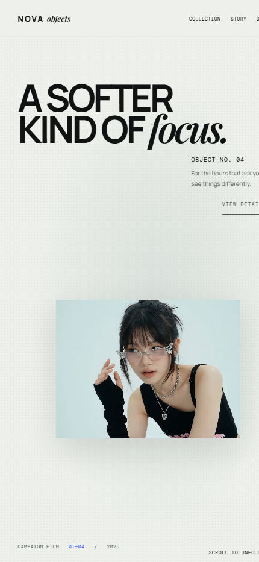

# NOVA OBJECTS — No. 04

An editorial, scroll-led landing page for a fictional eyewear study. It pairs a precise typographic layout with a continuous campaign film and a small collection of product objects.



<p align="center">
  
</p>

## Highlights

- One continuous campaign video mapped directly to scroll position
- Expanding hero frame with an optional scroll-end auto-complete
- Product reveals layered above the campaign film
- Responsive product-study gallery with staggered entrances
- Keyboard-friendly navigation, reduced-motion support, and enhanced contrast support
- No build tooling or local server required

## Run locally

Open [`index.html`](index.html) directly in a modern browser. All video and imagery are loaded from local relative paths, so the experience also works on any static host.

## Project structure

```text
.
├── assets/
│   ├── glasses.jpg … glasses4.jpg   # Product photography
│   ├── scroll down.mp4              # Scroll-controlled campaign film
│   └── scroll up.mp4                # Source companion footage
├── docs/
│   ├── preview-desktop.png          # Desktop project screenshot
│   └── preview-mobile.png           # Mobile project screenshot
└── index.html                       # The complete single-page experience
```

## Interaction notes

The campaign video remains paused: each scroll position selects its matching frame. When a visitor stops after roughly 40% of the sequence while moving forward, the page gently completes the journey to its final frame. Visitors who prefer reduced motion receive a static, non-pinned composition instead.

## Credits

Design and front-end concept: NOVA OBJECTS study 04.
